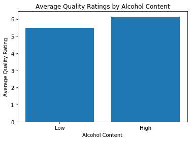
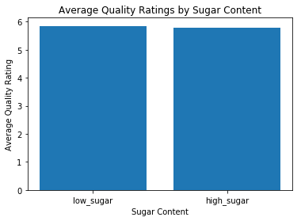
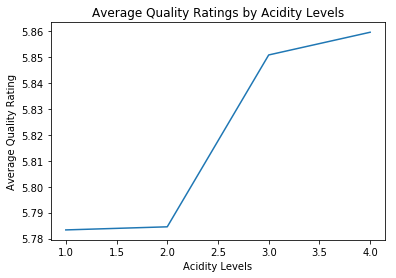

# 用 Matplotlib 绘图
用 Matplotlib 创建柱状图，显示用 groupby 和查询功能做出的结论。


```python
# 导入所需数据包并加载 `winequality_edited.csv`
import pandas as pd
import matplotlib.pyplot as plt
% matplotlib inline

df = pd.read_csv('winequality_edited.csv')
df.head()
```


<div>
<style>
    .dataframe thead tr:only-child th {
        text-align: right;
    }

    .dataframe thead th {
        text-align: left;
    }

    .dataframe tbody tr th {
        vertical-align: top;
    }
</style>
<table border="1" class="dataframe">
  <thead>
    <tr style="text-align: right;">
      <th></th>
      <th>fixed_acidity</th>
      <th>volatile_acidity</th>
      <th>citric_acid</th>
      <th>residual_sugar</th>
      <th>chlorides</th>
      <th>free_sulfur_dioxide</th>
      <th>total_sulfur_dioxide</th>
      <th>density</th>
      <th>pH</th>
      <th>sulphates</th>
      <th>alcohol</th>
      <th>quality</th>
      <th>color</th>
      <th>acidity_levels</th>
    </tr>
  </thead>
  <tbody>
    <tr>
      <th>0</th>
      <td>7.4</td>
      <td>0.70</td>
      <td>0.00</td>
      <td>1.9</td>
      <td>0.076</td>
      <td>11.0</td>
      <td>34.0</td>
      <td>0.9978</td>
      <td>3.51</td>
      <td>0.56</td>
      <td>9.4</td>
      <td>5</td>
      <td>red</td>
      <td>p4</td>
    </tr>
    <tr>
      <th>1</th>
      <td>7.8</td>
      <td>0.88</td>
      <td>0.00</td>
      <td>2.6</td>
      <td>0.098</td>
      <td>25.0</td>
      <td>67.0</td>
      <td>0.9968</td>
      <td>3.20</td>
      <td>0.68</td>
      <td>9.8</td>
      <td>5</td>
      <td>red</td>
      <td>p2</td>
    </tr>
    <tr>
      <th>2</th>
      <td>7.8</td>
      <td>0.76</td>
      <td>0.04</td>
      <td>2.3</td>
      <td>0.092</td>
      <td>15.0</td>
      <td>54.0</td>
      <td>0.9970</td>
      <td>3.26</td>
      <td>0.65</td>
      <td>9.8</td>
      <td>5</td>
      <td>red</td>
      <td>p3</td>
    </tr>
    <tr>
      <th>3</th>
      <td>11.2</td>
      <td>0.28</td>
      <td>0.56</td>
      <td>1.9</td>
      <td>0.075</td>
      <td>17.0</td>
      <td>60.0</td>
      <td>0.9980</td>
      <td>3.16</td>
      <td>0.58</td>
      <td>9.8</td>
      <td>6</td>
      <td>red</td>
      <td>p2</td>
    </tr>
    <tr>
      <th>4</th>
      <td>7.4</td>
      <td>0.70</td>
      <td>0.00</td>
      <td>1.9</td>
      <td>0.076</td>
      <td>11.0</td>
      <td>34.0</td>
      <td>0.9978</td>
      <td>3.51</td>
      <td>0.56</td>
      <td>9.4</td>
      <td>5</td>
      <td>red</td>
      <td>p4</td>
    </tr>
  </tbody>
</table>
</div>


### #1: 酒精含量高的酒是否评分较高？
创建柱状图，用一个条柱表示酒精含量低的酒样本，另一个条柱表示酒精含量高的酒样本。第一个条柱已填充了数据。


```python
# 用查询功能选择每个组，并获取其平均质量
median = df['alcohol'].median()
low = df.query('alcohol < {}'.format(median))
high = df.query('alcohol >= {}'.format(median))

mean_quality_low = low['quality'].mean()
mean_quality_high = high['quality'].mean()
```


```python
# 用合适的标签创建柱状图
locations = [1, 2]
heights = [mean_quality_low, mean_quality_high]
labels = ['Low', 'High']
plt.bar(locations, heights, tick_label=labels)
plt.title('Average Quality Ratings by Alcohol Content')
plt.xlabel('Alcohol Content')
plt.ylabel('Average Quality Rating');
```





### #2: 口感较甜的酒是否评分较高？
创建柱状图，用一个条柱表示残留糖分低的酒样本，另一个条柱表示残留糖分高的酒样本。


```python
# 用查询功能选择每个组，并获取其平均质量
sugar_avg = df['residual_sugar'].mean()
low_sugar = df.query('residual_sugar < {}'.format(sugar_avg))
high_sugar = df.query('residual_sugar >= {}'.format(sugar_avg))

low_sugar_quality = low_sugar['quality'].mean()
high_sugar_quality = high_sugar['quality'].mean()
```


```python
# 用合适的标签创建柱状图
locations = [1,2]
heights = [low_sugar_quality,high_sugar_quality]
x_ticks = ['low_sugar','high_sugar']
plt.bar(locations,heights,tick_label=x_ticks)
plt.title('Average Quality Ratings by Sugar Content')
plt.xlabel('Sugar Content')
plt.ylabel('Average Quality Rating');
```





### #3: 哪个酸度水平的平均评分最高？
创建柱状图，四个酸度水平分别用一个条柱表示。


```python
# 使用分组功能获取每个酸度水平的平均质量
df_p1 = df.query('acidity_levels == "p1"')
df_p2 = df.query('acidity_levels == "p2"')
df_p3 = df.query('acidity_levels == "p3"')
df_p4 = df.query('acidity_levels == "p4"')

df_p1_quality = df_p1['quality'].mean()
df_p2_quality = df_p2['quality'].mean()
df_p3_quality = df_p3['quality'].mean()
df_p4_quality = df_p4['quality'].mean()
```


```python
# 用合适的标签创建柱状图
locations = [1,2,3,4]
heights = [df_p1_quality,df_p2_quality,df_p3_quality,df_p4_quality]
x_ticks = ['p1','p2','p3','p4']
# plt.bar(locations,heights,tick_label=x_ticks)
plt.plot(locations,heights)
plt.title('Average Quality Ratings by Acidity Levels')
plt.xlabel('Acidity Levels')
plt.ylabel('Average Quality Rating');
```





### 附加题：为 #3 中的数据创建线图
可以使用 pyplot 的 [绘图](https://matplotlib.org/api/pyplot_api.html#matplotlib.pyplot.plot) 功能进行创建。

将线图与柱状图相比较。如果用线图代替柱状图，会对数据结论产生什么影响？
